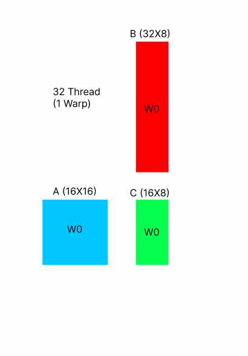
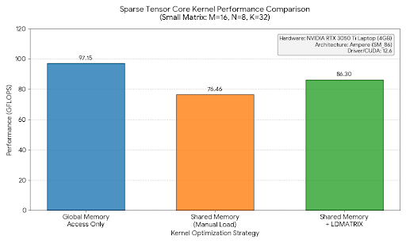
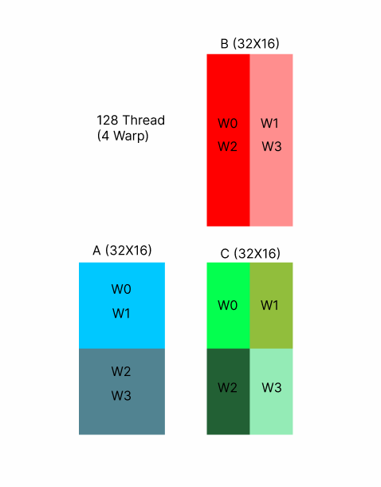
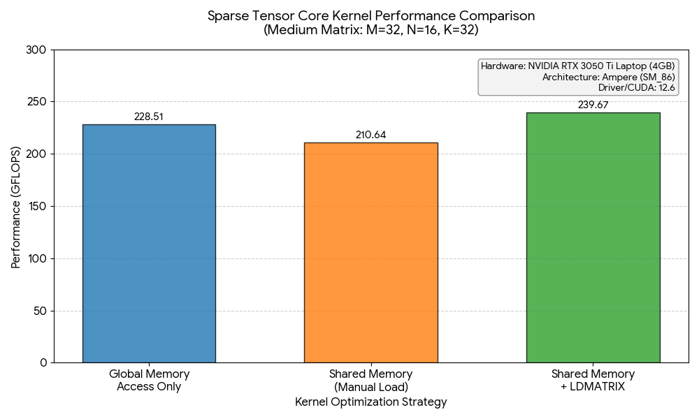
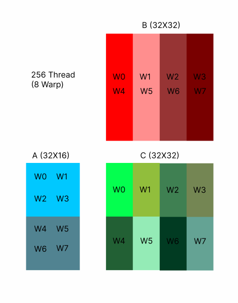
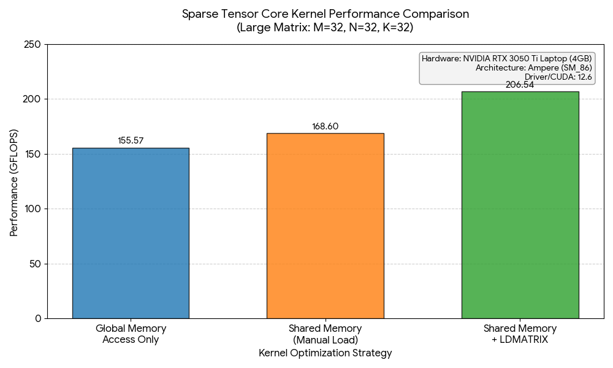

# 🚀 Performance Analysis of Sparse Tensor Cores on NVIDIA Ampere Architecture

 -76b900.svg) 

## 🎓 CENG415 Graduation Project
**Author:** Ahmet  
**Institution:** İzmir Institute of Technology (IZTECH)  
**Department:** Computer Engineering

---

## 📖 Project Overview
This project benchmarks and analyzes the memory hierarchy trade-offs when using **Sparse Tensor Cores (`mma.sp`)** on NVIDIA Ampere architecture. Specifically, it investigates the performance gap between standard **Global Memory** access, manual **Shared Memory** caching, and the hardware-accelerated **`ldmatrix`** pipeline.

The core objective is to determine the "crossover point" where the overhead of setting up a complex Shared Memory pipeline pays off against the simplicity of L1/L2 caching mechanisms.

## 🎯 What We Are Testing? (Objectives)
The project evaluates three distinct memory access strategies across varying workload sizes (Scaling Analysis) to answer the following research questions:

1.  **Baseline (Global Memory):** Can the L1/L2 cache hierarchy of the Ampere architecture handle Tensor Core data feeding efficiently without manual optimization?
2.  **Manual Caching (Shared Memory):** Does explicitly loading data into Shared Memory improve performance, or does the instruction overhead create a bottleneck?
3.  **Hardware Acceleration (LDMATRIX):** How much performance gain does the `ldmatrix.sync.aligned` instruction provide by bypassing register file bank conflicts and reducing load/store instructions?

We test these strategies under three different scaling scenarios:
* **Small Workload (One Warp):** $16 \times 8 \times 32$
* **Medium Workload (Four Warps):** $32 \times 16 \times 32$
* **Large Workload (Eight Warps):** $32 \times 32 \times 32$

---

## 📊 Benchmark Analysis & Warp Layouts

### 📉 Scenario 1: Small Workload (One Warp)
In this scenario, a single Warp (32 threads) processes the entire $M=16, N=8, K=32$ matrix multiplication. This is the smallest unit of work for Tensor Cores.

#### 1. Warp Layout Strategy
The figure below illustrates how the single warp is mapped to the A, B, and C matrices. Since the workload fits into a single Tensor Core operation, no tiling loop is required.



#### 2. Performance Results
When running the benchmark on this small workload, we observed an interesting result where the simplest approach outperformed the most complex one.



#### Critical Analysis: Why these results?

**1. Why is Global Memory the Winner? (~97 GFLOPS)**
* **L1 Cache Hit Rate (~61%):** Since the matrices are tiny, they fit entirely inside the L1 Cache.
* **Zero Overhead:** The Global Memory kernel reads directly from L1 Cache. It avoids the latency of `__syncthreads()` barriers and the pipeline setup required for Shared Memory.
* **Conclusion:** For small data, the hardware cache is smarter and faster than manual software management.

**2. Why is "Shared Memory (Manual)" the Loser? (~76 GFLOPS)**
* **Strided Scalar Access:** To manually feed Tensor Cores, threads must load data in a specific strided pattern (usually 32-bit scalar loads). This prevents using efficient vectorized (128-bit) load instructions.
* **Recurring Bank Conflicts:** Since the manual approach requires multiple load instructions (e.g., 4 separate loads) to fill the registers, **each** instruction runs the risk of hitting a bank conflict. A conflict here is penalized 4 times over, causing severe serialization in the pipeline.

**3. Why is LDMATRIX faster than Manual Shared Memory? (~86 GFLOPS)**
* **Vectorized 128-bit Alignment:** `ldmatrix` allows each thread to load a **128-bit aligned chunk** from Shared Memory in a single operation. Even if there is a bank conflict, it happens on a single instruction rather than four.
* **Instruction Efficiency:** The hardware handles the distribution of data from Shared Memory to the complex Register File layout required by Tensor Cores. This replaces multiple scalar load instructions and complex pointer arithmetic with a single hardware-accelerated instruction.

---

### 📈 Scenario 2: Transition Zone (Four Warps)
In this scenario, we scale up the workload to **4 Warps (128 threads)** processing a $M=32, N=16, K=32$ matrix. This represents a medium-sized tile, typical for internal loops of larger GEMM kernels.

#### 1. Warp Layout Strategy
To handle the larger $M$ and $N$ dimensions, we distribute the workload across 4 Warps.
* **Warps 0-3** are assigned to cover the output matrix $C$ in a tiled manner.
* This requires synchronized data loading from $A$ and $B$ into Shared Memory so that all warps can access the necessary fragments.



#### 2. Performance Results
**This is the Crossover Point.** The leadership changes hands from Global Memory to the `ldmatrix` pipeline.

* **Winner:** 🏆 Shared Memory + LDMATRIX (~240 GFLOPS)
* **Runner-up:** Global Memory (~228 GFLOPS)
* **Loser:** Manual Shared Memory (~210 GFLOPS)



#### Critical Analysis: The Turning Point

**1. Why did LDMATRIX take the lead?**
* **Amortization of Overhead:** In the previous scenario (One Warp), the cost of setting up the Shared Memory pipeline outweighed the compute benefit. Now, with a larger workload, the computation time is long enough to "hide" (amortize) the pipeline latency.
* **Throughput Efficiency:** The `ldmatrix` instruction feeds the Tensor Cores at a sustained rate that slightly exceeds what the L1 Cache can provide directly from Global Memory.

**2. Why is Global Memory losing its edge?**
* **Cache Pressure:** As the data size grows, the **L1 Cache Hit Rate** begins to drop. The cache is no longer a "perfect" storage for the entire matrix.
* **Instruction Replay:** With more threads active (128 threads), contention for memory resources increases, leading to slight stalls in the Global Memory path.

**3. Why is Manual Shared Memory still struggling?**
* It remains the slowest because it combines the "bad parts" of both worlds:
    1.  It has the high setup latency of the Shared Memory pipeline.
    2.  It lacks the hardware acceleration of `ldmatrix` to move data from Shared Memory to Registers efficiently.
    3.  It still suffers from **Bank Conflicts** due to non-vectorized, strided loads.

---

### 🚀 Scenario 3: Large Workload (Eight Warps)
In this final scenario, we maximize the workload for this specific kernel design by using **8 Warps (256 threads)** to compute a $M=32, N=32, K=32$ matrix. This simulates a realistic "dense" tile computation found in high-performance libraries like cuBLAS.

#### 1. Warp Layout Strategy
With 256 threads active, we distribute the $C$ matrix calculation across 8 Warps.
* **Tiling:** The $32 \times 32$ output matrix is divided into 8 rectangular tiles ($16 \times 8$ each).
* **Work Distribution:** Each Warp is responsible for computing a specific sub-tile of the result, requiring synchronized access to the shared $A$ and $B$ data.



#### 2. Performance Results
**The Conclusion.** As the workload scales up, the naive Global Memory approach collapses, while the hardware-accelerated pipeline maintains high throughput.

* **Winner:** 🏆 Shared Memory + LDMATRIX (~206 GFLOPS)
* **Runner-up:** Manual Shared Memory (~168 GFLOPS)
* **Loser:** 📉 Global Memory Access Only (~155 GFLOPS)



#### Critical Analysis: The "Cache Wall"

**1. Why did Global Memory crash? (228 $\to$ 155 GFLOPS)**
* **Cache Saturation:** In smaller workloads, the L1 Cache acted as a "magic" high-speed buffer. However, with 256 threads constantly requesting data from a $32 \times 32 \times 32$ volume, the L1 cache size is exceeded.
* **Thrashing:** Data is evicted from the cache before it can be reused effectively, forcing the GPU to fetch from the much slower L2 Cache or DRAM. This is known as "Cache Thrashing."

**2. The LDMATRIX Dominance (~33% Faster)**
* **Latency Hiding:** The `Shared Memory -> LDMATRIX -> Tensor Core` pipeline is designed precisely for this scenario. While the Tensor Cores are crunching numbers, the `ldmatrix` instruction is pre-fetching the next chunk of data from Shared Memory.
* **Sustained Throughput:** Unlike the cache-dependent global memory kernel, the explicit pipeline delivers a consistent stream of data, unaffected by cache eviction policies.

> **Final Verdict:** While simple Global Memory kernels are sufficient for tiny problems, **explicit Shared Memory management with `ldmatrix` is mandatory for scalable, high-performance matrix multiplication on NVIDIA Ampere architecture.**

---

## 🛠️ How to Build and Run

### Prerequisites
To reproduce these benchmarks, you need the following environment:
* **Hardware:** NVIDIA GPU with Compute Capability **8.0+** (Ampere Architecture).
    * *This project was validated on RTX 3050 Ti (sm_86).*
* **Software:** CUDA Toolkit 11.2+ (CUDA 12.6 recommended).

### 🚀 Compilation
We use `nvcc` with C++17 standard enabled. You can compile the specific scenario you want to test by pointing to the corresponding `.cu` file.

**Example: Compiling the Large Workload**
```bash
nvcc -arch=sm_86 -std=c++17 Sparse_TensorCore_Memory_Eval_OneWarp.cu -o benchmark_result_OneWarp
nvcc -arch=sm_86 -std=c++17 Sparse_TensorCore_Memory_Eval_FourWarp.cu -o benchmark_result_FourWarp
nvcc -arch=sm_86 -std=c++17 Sparse_TensorCore_Memory_Eval_EightWarp.cu -o benchmark_result_EightWarp